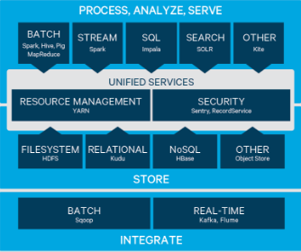

# Introduction to Hadoop

The Apache Hadoop  is an open-source software framework that allows for the distributed processing of large data sets across clusters of computers using simple programming models (MapReduce). It is designed to scale up from single servers to thousands of machines, each offering local computation and storage.   http://hadoop.apache.org/  

Doug Cutting (one of the founders of Hadoop).

You can build Hadoop stacks yourself downloading from apache Hadoop or download the pre-built software stacks from the below companies. 
Cloudera, Hortonworks and MapR  provide the core pre-built software stacks for free and offer commercial support for production environments. 

[Apache Hadoop ecosystem    over 100 projects.](https://hadoopecosystemtable.github.io/)

[Cloudera Diagram.](https://www.cloudera.com/products/open-source/apache-hadoop/hdfs-mapreduce-yarn.html)

##The main parts of Hadoop:

HDFS The Hadoop distributed file system is a scalable, fault-tolerant (reliable), distributed storage system that works closely with a wide variety of concurrent data access applications.  HDFS is the foundation for many big data frameworks. https://hortonworks.com/apache/hdfs/

HDFS achieves scalability by partitioning or splitting large files across multiple computers. This allows parallel access to very large files since the computations run in parallel on each node where the data is stored.

HDFS replicates file blocks on different nodes to prevent data loss. By default, HDFS maintains three copies of every block. 

HDFS is comprised of two components. NameNode, and DataNode. These operate using a master slave relationship. 

